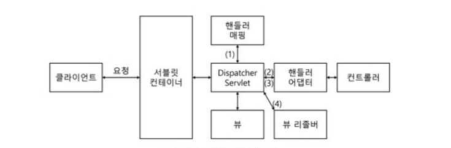

# 1. 개발에 앞서 알면 좋은 기초 지식

### 1. 서번 간 통신

  - 마이크로서비스 아키텍쳐(MSA): 하나의 애플리케이션에 여러 기능을 넣어 개발하지 않고 나누어서 개발

  - 서버 간 통신: 독립적인 애플리케이션에서 각 서비스 간의 통신, 한 서버가 다른 서버에 통신을 요청하는 것을 의미(한 대는 서버, 다른 한 대는 클라이언트)

      방식: HTTP/HTTPS

### 2. 스프링 부트의 동작 방식

  - spring-boot-web 모듈을 사용하면 기본적으로 톰캣을 사용하는 스프링 MVC 구조를 기반으로 동작
    

    - 서블릿: 클라이언트의 요청을 처리하고 결과를 반환하는 자바 웹 프로그래밍 -> 서블릿 컨테이너에서 관리

      <서블릿 컨테이너 특징>

      - 서블릿 객체를 생성, 초기화, 호출, 종료하는 생명주기를 관리
     
      - 서블릿 객체는 싱글톤 패턴으로 관리
     
      - 멀티 스레딩 지원
     
  - 스프링에서는 DispatcherServlet이 서블릿 역할 수행, 일반적으로 스프링은 톰캣을 임베드해 사용함

    <방식>
    
    1.  DispatcherServlet으로 요청(HttpServletRequest)이 들어오면 DispatcherServlet은 핸들러 매핑을 통해 요청 URI에 매핑된 핸들러를 탐색한다(핸들러는 컨트롤러(Controller)를 의미함).
    
    2.  그리고 핸들러 어댑터로 컨트롤러를 호출한다.
    
    3.  핸들러 어댑터에 컨트롤러의 응답이 돌아오면 ModelAndView로 응답을 가공해 반환한다.
    
    4.  뷰 형식으로 리턴하는 컨트롤러를 사용할 때는 뷰 리졸버를 통해 뷰를 받아 리턴한다.
       
      
      + 핸들러 매핑은 요청 정보를 기준으로 어떤 컨트롤러를 사용할지 선정하는 인터페이스
      
      + 뷰 리졸버는 뷰의 렌더링 역할을 담당하는 뷰 객체를 반환
   
### 3. 레이어드 아키텍처
    - 애플리케이션의 컴포넌트를 유사 관심사를 기준으로 레이어로 묶어 수평적으로 구성한 구조

    <일반적인 레이어드 아키텍쳐- 3계층>
    
      - 프레젠테이션 계층

          1. 애플리케이션의 최상단 계층, 클라이언트의 요청을 해석하고 응답하는 역할

          2. UI, API를 제공

          3. 별도의 비즈니스 로직을 포함하고 있지 않으므로 비즈니스 계층으로 요청을 위임하고 받은 결과를 응답하는 역할 수행
          
      - 비즈니스 계층

          1. 애플리케이션이 제공하는 기능을 정의하고 세부 작업을 수행하는 도메인 객체를 통해 업무를 위임하는 역할을 수행

          2. DDD기반의 아키텍처에서는 비즈니스 로직에 도메인이 포함되기도 하고, 별도로 도메인 객층을 두기도 함
          
      - 데이터 접근 계층

          1. 데이터베이스에 접근하는 일련의 작업을 수행

    <레이어드 아키텍쳐 특징>
    
      1. 각 레이어는 가장 가까운 하위 레이어의 의존성 주입받음

      2. 각 레이어는 관심사에 따라 묶여 있고, 다른 레어의 역할 침범 X

        - 각 컴포넌트 역할이 명확하니 코드의 가독성과 기능 구현에 유리

        - 코드의 확장성도 좋아짐

      3. 각 레이어가 독립적으로 다른 레이어와의 의존성을 낮춰 단위 테스트에 용이
  <스프링 레이어드 아키텍쳐>
    
      - 프레젠테이션 계층

          1. 유저 인터페이스 계층이라고도 불림

          2. 클라이언트와의 접점

          3. 클라이언트로부터 데이터와 함께 요청을 받고 처리 결과를 응답으로 전달하는 역할
          
      - 비즈니스 계층

          1. 상황에 따라 서비스 계층이라고 함
          
          2. 핵심 비즈니스 로직을 구현하는 영역
          
          3. 트랜젝션 처리나 유효성 검사 등의 작업 수행

      - 데이터 접근 계층

          1. 상황에 따라 영속 계층이라고 함

          2. 데이터베이스에 접근해야 하는 작업

### 4. 디자인 패턴
  - 소프트웨어를 설계할 때 자주 발생하는 문제들을 해결

    1. 디자인 패턴의 종류
   
       1. 생성 패턴
      
          - 객체 생성에 사용되는 패턴, 객체를 수정해도 호출부가 영향을 받지 않게 함
      
       2. 구조 패턴
      
          - 객체를 조합해서 더 큰 구조를 만드는 패턴
      
       3. 행위 패턴
      
          - 객체 간의 알고리즘이나 책임 분배에 관한 패턴
         
          - 객체 하나로는 수행할 수 없는 작업을 여러 객체를 이용해 작업을 분배, 결합도 최소화를 고려할 필요가 없음
         
    2. 생성 패턴
   
       - 추상 팩토리: 구체적인 클래스를 지정하지 않고 상황에 맞는 객체를 생성하기 위한 인터페이스를 제공하는 패턴
      
       - 빌더: 객체의 생성과 표현을 분리해 객체를 생성하는 패턴
      
       - 팩토리 메서드: 객체 생성을 서브클래스로 분리해서 위임하는 패턴
      
       - 프로토타입: 원본 객체를 복사해 객체를 생성하는 패턴
      
       - 싱글톤: 한 클래스마다 인스턴스를 하나만 생성해서 인스턴스가 하나임을 보장하고 어느 곳에서도 접근할 수 있게 제공하는 패턴
      
    3. 구조 패턴

       - 어댑터: 클래스의 인터페이스를 의도하는 인터페이스로 변환하는 패턴
         
       - 브리지: 추상화의 구현을 분리해서 각각 독립적으로 변경케 하는 패턴
         
       - 컴포지트: 여러 객체로 구성된 복합 객체와 단일 객체를 클라이언트에서 구별 없이 다루는 패턴
    
       - 데코레이터: 객체의 결합을 통해 기능을 동적으로 유연하게 확장할 수 있게 하는 패턴
      
       - 퍼사드: 서브시스템의 인터페이스 집합들에 하나의 통합된 인터페이스를 제공하는 패턴
      
       - 플라이웨이트: 특정 클래스의 인스턴스 한 개를 가지고 여러 개의 '가상 인스턴스'를 제공할 때 사용하는 패턴
      
       - 프락시: 특정 객체를 직접 참조하지 않고 해당 객체를 대행(프락시)하는 객체를 통해 접근하는 패턴
      
    4. 행위 패턴
   
       - 책임 연쇄: 요청 처리 객체를 집합으로 만들어 결합을 느슨하게 만드는 패턴
      
       - 커맨드: 실행될 기능을 캡슐화해서 주어진 여러 기능을 실행하도록 클래스를 설계하는 패턴
      
       - 인터프리터: 주어진 언어의 문법을 위한 표현 수단을 정의하고 해당 언어로 구성된 문장을 해석하는 패턴
      
       - 이터레이터: 내부 구조를 노출하지 않으면서 해당 객체의 집합 원소에 순차적으로 접근하는 방법을 제공하는 패턴
      
       - 미디에이터: 한 집합에 속한 객체들의 상호작용을 캡슐화하는 객체를 정의한 패턴
      
       - 메멘토: 객체의 상태 정보를 저장하고 필요에 따라 상태를 복원하는 패턴
      
       - 옵저버: 객체의 상태 변화를 관찰하는 관찰자들, 즉 옵저버 목록을 객체에 등록해 상태가 변할 때마다 메서드 등을 통해 객체가 직접 옵저버에게 통지하게 하는 디자인 패턴

       - 스테이트: 상태에 따라 객체가 행동을 변하게 하는 패턴
      
       - 스트래티지: 행동을 클래스로 캡슐화해서 동적으로 행동을 바꿀 수 있게 하는 패턴
      
       - 템플릿 메서드: 일정 작업을 처리하는 부분을 서브클래스로 캡슐화해서 전체 수행 구조는 바꾸지 않으면서 특정 단계만 변경해서 수행하는 패턴
      
       - 비지터: 실제 로직을 가지고 있는 객체가 로직을 적용할 객체를 방문하며 실행하는 패턴
      
---
  ### 5. REST API

    1. rest란?
    
        - www과 같은 분산 하이퍼미디어 시스템 아키덱처의 한 형식, 주고받는 자원에 이름을 규정하고 URI에 명시해 HTTP 매서드를 통해 해당 자원의 상태를 주고받는 것

    2. REST API란?

        - 애플리케이션을 제공하는 인터페이스를 의미, REST 아키텍처를 따르는 시스템/애플리케이션 인터페이스라고 볼 수 있음

        - RESRful: REST 아키텍처를 구현하는 웹서비스 의미

    3. REST API 특징

        1. 유니폼 인터페이스
        
         == 일관된 인터페이스
  
        2. 무상태성
        
         == 서버에 상태 정보를 따로 보관하거나 관리하지 않는다
  
        3. 캐시 가능성
  
          - REST는 HTTP 표준을 그대로 사용하므로 HTTP의 캐싱 기능을 적용할 수 있음
  
        4. 레이어 시스템
  
          - 네트워크 상의 여러 계층으로 구성될 수 있음
  
        5. 클라이언트- 서버 아키텍처
  
          - API를 제공하고 클라이언트는 사용자 정보를 관리하는 구조로 분리해 설계, 의존성을 낮춤
        
    4. REST의 URI 설계 규칙

      - URL 규칙

        1. url 마지막에 '/' 포함 X
       
        2. 언더바(_)를 사용하지 않음, 하이픈(-) 쓰기
       
        3. URL에는 행위 동사가 아닌 결과(명사)를 포함
       
        4.  url은 소문자로 작성
       
        5.  파일의 확장자는 url에 포함X
  
      
    

    
